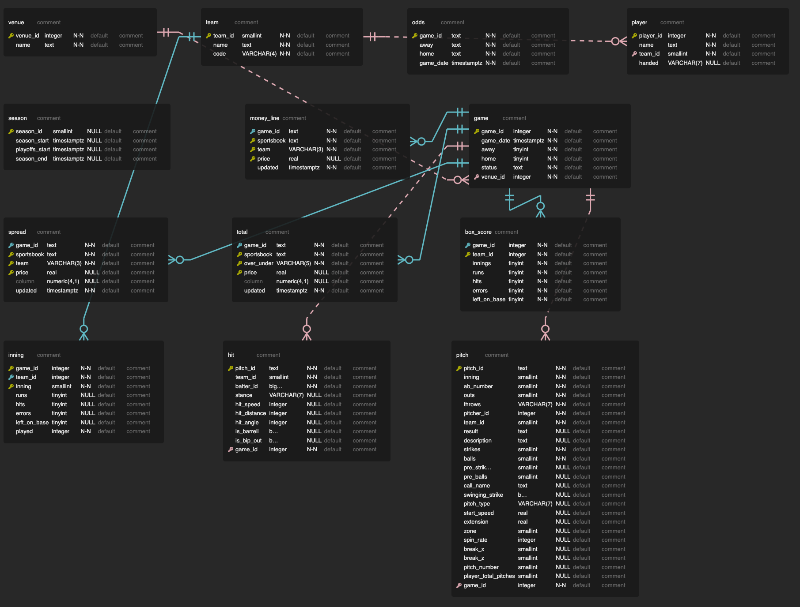

# mlb

Repository to create a sqlite DB of data from the mlb.stats API

# To create the database
clone the repository
```bash
git clone https://github.com/jrey999/mlb.git && cd mlb
```
create a virtual environment
```bash
python3 -m venv venv --prompt <name your environment>
```
install required Python libraries
```bash
pip install --upgrade pip -r requirements.txt
```

create tables 
```bash
./shell/schema.sh
```

collect data for the team, venue and game tables
```bash
python game.py
```

collect data for the inning, player, hit and pitch tables
```bash
python pitch.py
```

aggregate data for the box_score table
```bash
./shell/aggregations.sh
```
schema can be changed by changing the SQL in the schema folder, ERD of the table is available below
